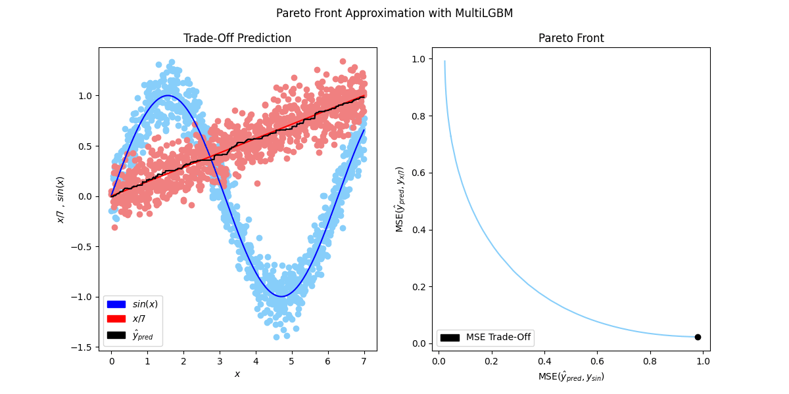

<div align="center">

# MultiLGBM: A simple multi-objective regression example to show how to trade-off objectives on the Pareto front with a single LGBM model.


**This repository presents a multi-objective regression example with ${\bf f_1(x)=sin(x)}$ and ${\bf f_2(x)=x/7}$, demonstrating that [Pareto front approximation (PFA)](https://arxiv.org/abs/2501.10945) techniques, traditionally applied to deep neural networks like [MultiTRON](https://arxiv.org/abs/2407.16828), can also be effectively adapted to tree-based models like [LightGBM](https://lightgbm.readthedocs.io/en/stable/). This showcases the versatility of PFA in optimizing multiple objectives across various machine learning architectures. Given [LightGBM's](https://lightgbm.readthedocs.io/en/stable/) widespread use in solving real-world, industry-scale problems, it has been selected for this example. The employed technique is referred to as MultiLGBM.**


</div>

## 💡 Procedure & how it works

For each labeled point ($x$, $y_1$, $y_2$) we are going to add a sampled a parameter $p=(p_{1}, p_{2})$ from a two dimensional dirichlet distribution to the input $x$ of the LightGBM model $\mathcal{M}$. Additionally, we are going to weight the two objectives / [MSE's](https://en.wikipedia.org/wiki/Mean_squared_error) with $p$:

```math
 \mathcal{L}(x,p, y_1, y_2)=p_1 (\mathcal{M}(x, p) - y_1)^2 + p_2 (\mathcal{M}(x, p) - y_2)^2 + \lambda \mathcal{L}_{\text{reg}},
```

 where $y_1$ is the target for the $sin(x)$ task, $y_2$ is the target for the $f_2(x)=x/7$ task, $`\mathcal{L}_{\text{reg}}`$ is the non-uniformity regularization and $\lambda$ is its penalty. For this example $\lambda = 0$ and hence $`\mathcal{L}_{\text{reg}}`$ can be ignored. After training, we optain a model $`\mathcal{M}`$ that can be conditioned on $`p`$ at inference time. Now, we are able to compute $`\hat{y}_{pred}=\mathcal{M}(x,p)`$ and access the entire Pareto front, as it can be seen on the picture below.

 For further information, we refer to [MultiTRON](https://arxiv.org/abs/2407.16828), where this technique has been successfully applied to industry-scale sequential recommender systems with a transformer neural network as backbone.




## 🚀 Quick Start

1. Clone the repository:

```bash
git clone https://github.com/timowilm1992/MultiLGBM
```

2. Install the dependencies:

```bash
pip install pipenv
pipenv install --dev
```

3. Prepare a dataset (e.g., "sinus_linear"):

```bash
pipenv run python -m src.sinus_linear.generate_data --number-train-examples 50000 --number-test-examples 1000 --plot True
```

4. Run the main script with a configuration file:

```bash
pipenv run python -m src.main --dataset-name sinus_linear --config-name sinus_linear/default_config --plot True
```

## 🗂️ Repository Structure

```yaml
.
├── Pipfile
├── Pipfile.lock
├── README.md
├── configs                # Contains experiment configuration files
└── src                    # Source code 
```

## ⚙️ Config File Documentation

The [config folder](configs/) contains a JSON configuration file. These configurations detail the parameters and options.

Here's an explanation of each parameter in the config file:
- `dirichlet_param`: The dirichlet parameter to specify the dirichlet distribution for sampling, `default` is [0.5, 0.5]
- `repeat`: how often should a dirichlet weight be sampled  for each data point, equivalent to the number of epochs for deep neural networks 
- `regularization`: The penalty $\lambda$ of the  non-uniformity regularization term to improve pareto front coverage, `default` is 0.0
- `lgbm_params`: The Parameters of the underlying [LightGBM model](https://lightgbm.readthedocs.io/en/latest/Parameters.html), the `objective` parameter is "sinus_and_linear_mse"

### Example Config File for MultiLGBM on the "sinus_linear" Dataset

```json
{
    "dirichlet_param": [0.5, 0.5],
    "repeat": 10,
    "regularization": 0.0,
    "lgbm_params": {
        "random_seed": 0,
        "objective": "sinus_linear_loss",
        "max_depth": 5,
        "num_leaves":10
    }
}
```

## 🙌 Contribution

Contributions to MultiLGBM are welcome and appreciated. For issues or suggestions for improvements, please open an issue or create a pull request. 

## 📖 Citing

If MultiLGBM helped you with your project or your research, please consider citing:

```bibtex
@misc{wilm_multilgbm_2025,
	title = {{MultiLGBM}: {A} simple multi-objective regression example to show how to trade-off objectives on the {Pareto} front with a single {LGBM} model},
	url = {https://github.com/timowilm1992/MultiLGBM},
	author = {Wilm, Timo},
	month = mar,
	year = {2025},
}
```

## 📜 License

This project is [MIT licensed](./LICENSE).

## 📞 Contact

For any queries or questions, please reach out to us via our LinkedIn profiles:

- [Timo Wilm](https://www.linkedin.com/in/timo-wilm)


For specific issues related to the codebase or for feature requests, please create a new issue on our [GitHub page](https://github.com/timowilm1992/MultiLGBM/issues).

If this project aids your research or you find it interesting, we would appreciate it if you could star ⭐ the repository. Thanks for your support!
